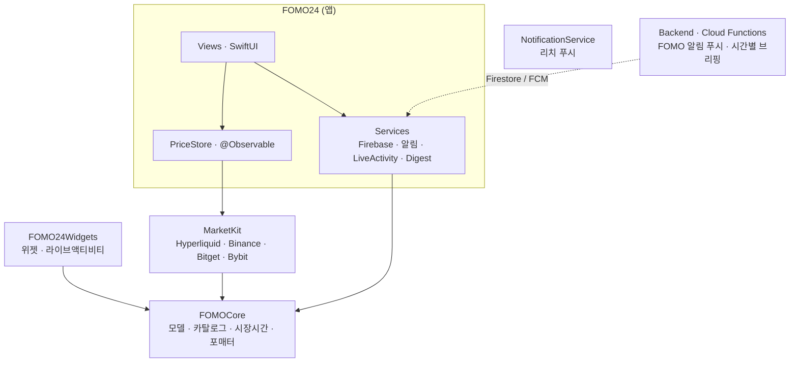

# FOMO24

[](https://github.com/yang-gwihyeon/FOMO24App/actions/workflows/ci.yml)
[](https://github.com/yang-gwihyeon/FOMO24App/actions/workflows/release.yml)
  

주식·코인 선물 시세를 4개 거래소에서 모아 보여주고, "샀다 치고" 기록의 가상 수익률과 알림, 개장 시계, 투자 캘린더,
다이나믹 아일랜드 실시간 추적, 홈 위젯, 시간별 AI 브리핑 푸시를 제공하는 iOS 앱. 거래 중개는 하지 않는다.

## 아키텍처

- 의존은 단방향: 앱 → MarketKit → FOMOCore. FOMOCore는 시스템 프레임워크만. 경계는 SwiftLint 커스텀 규칙으로 검사.
- Swift 6 언어 모드 + `SWIFT_STRICT_CONCURRENCY=complete`.
- 프로젝트 정의는 `Project.swift`(Tuist) 단일 소스. xcodeproj는 git에 없음.

## 시작하기
```bash
brew install tuist xcbeautify swiftlint swiftformat
make generate   # GoogleService-Info.plist 없으면 CI용 더미 자동 복사
make test       # FOMOCore + MarketKit 유닛테스트
make ci         # lint + format-check + test + build (CI와 동일)
```
`make help`로 전체 타깃 확인. 실제 Firebase 키는 커밋하지 않는다 (`scripts/check-secrets.sh`가 커밋 전 검사).

## 릴리즈
```bash
git tag v1.2 && git push origin v1.2   # → 아카이브 → TestFlight 자동 업로드
```
버전은 태그에서, 빌드 번호는 GitHub run number에서 주입된다 ([ADR-0004](docs/adr/0004-testflight-automation.md)).

## 개발 방식
- 모든 PR은 6칸 카드(관찰·가설·선택지·결정·측정·배운 것)를 채운다 — [PR 템플릿](.github/pull_request_template.md).
- 성능 변경은 측정이 먼저 — [docs/perf](docs/perf/README.md).
- 아키텍처 결정은 ADR — [docs/adr](docs/adr/README.md).
- AI 에이전트(Claude Code)는 선택지·초안·리뷰를 맡고, 기준·결정·측정은 사람이 — [ADR-0005](docs/adr/0005-ai-collaboration.md), [AI 워크플로](docs/AI_WORKFLOW.md).
- 리뷰 규칙 원문: [CODE_REVIEW.md](CODE_REVIEW.md) · AI 작업 지침: [CLAUDE.md](CLAUDE.md).

## 지표
| 항목 | 값 | 갱신 |
|---|---|---|
| 모듈 유닛테스트 | 27 (Swift Testing, 네트워크 0) | 2026-09-12 |
| SwiftLint 위반 | 24 (error 5) — 도입 시 기준선 | 2026-09-12 |
| 성능 기준선 | 미측정 → [B0 체크리스트](docs/perf/README.md) | — |
| CI 시간 | 11m30s (macOS 러너, 테스트+빌드 단일 잡, SPM 캐시 miss) — 기준선 | 2026-09-13 |

## 폴더
```
Modules/FOMOCore     순수 도메인 + 테스트
Modules/MarketKit    거래소 시세 서비스 + 테스트
Sources/             앱 (Views · ViewModels · Services)
Widgets/             위젯 · 라이브액티비티
NotificationService/ 리치 푸시 익스텐션
Backend/             Cloud Functions (알림 · 시간별 브리핑)
CI/                  CI용 더미 plist · ExportOptions
docs/                계획 · ADR · 성능 기록 · AI 워크플로
```
